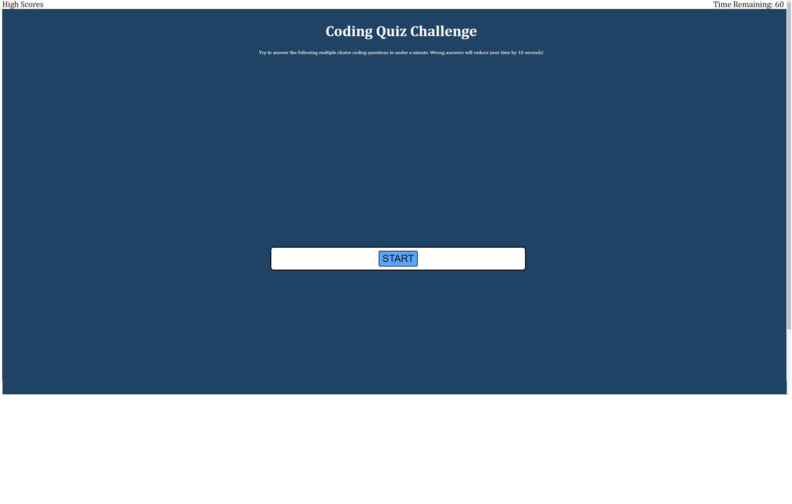

# JavaScript Quiz, by Mark Calcagno

## Description
This website tests the user's knowledge of JavaScript by asking them four multiple choice questions in 60 seconds.  Wrong answers result in 15 seconds being deducted from the time remaining.

## Installation
The project runs in the browser, and does not require an installation

## Usage
When the start button is pressed, the questions are asked in a randomized order.  Each right or wrong answer reveals the next button, but wrong answers will result in 15 seconds being deducted from the timer.  At the end of the quiz, the user's score is shown. There was a high score feature that was asked for, but I was unable to implement this in the time allotted.

## Screenshot

## Credits
Mark Calcagno
Tutor: Jaytee Padilla
Tutor: Jordy Williams

## Links
The site: https://mcalcagno47.github.io/JavaScriptQuiz/
My github: https://github.com/mcalcagno47/JavaScriptQuiz  

## Updates
Unfortunately, I was unable to include the High Score leaderboard in the assignment.  In the future, when time allows, I will return to this assignment and complete it.  I apologize for the lack of this feature.
